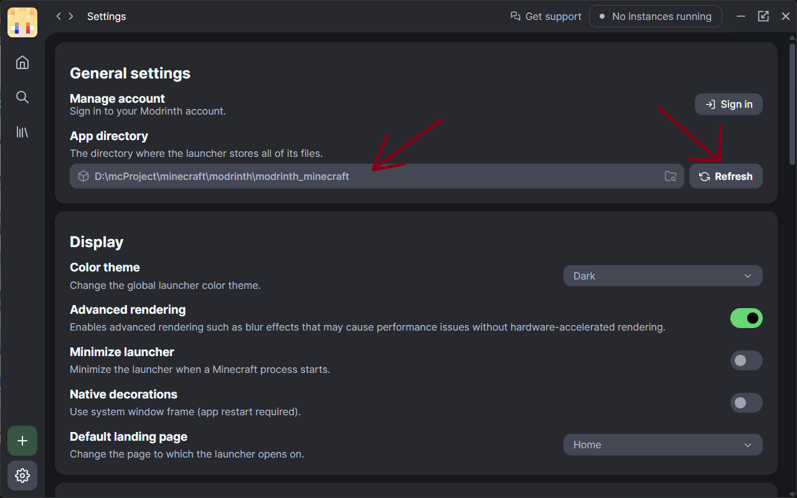
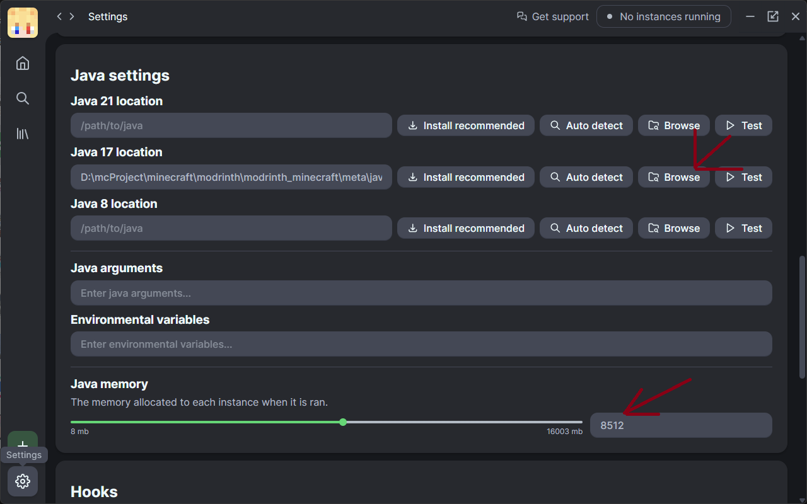

# Modrinth安装文档

## 运行.msi安装文件

在modrinth文件路径下

## 完成安装后点击左下角设置

## 设置好对应的mc库文件

相对路径为 ./minecraft/modrinth/modrinth_minecraft

设置完后点击refresh，确保mc被安装成功

## 设置java位置和运行内存

java 17相对路径：
./minecraft/modrinth/modrinth_minecraft/meta/java_versions/zulu17.52.17-ca-jre17.0.12-win_x64/bin/javaw.exe

运行内存8gb左右

